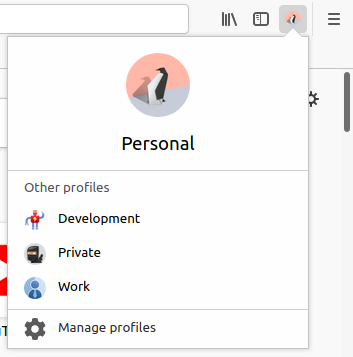
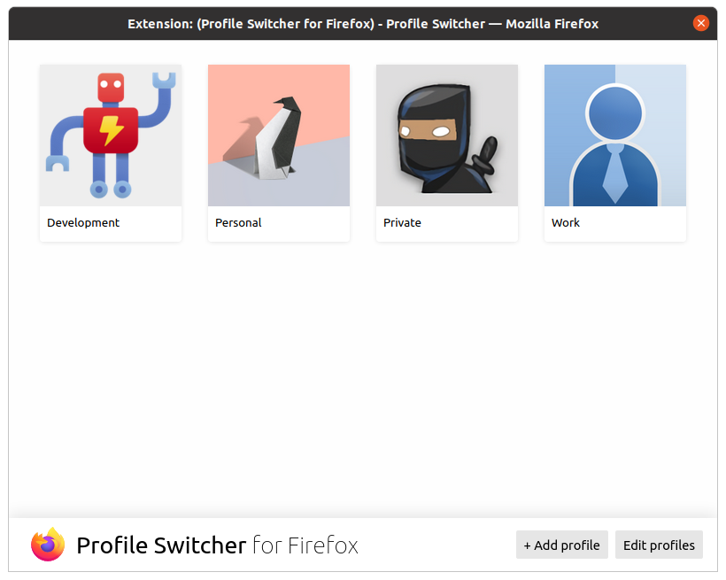

# Profile Switcher for Firefox

Create, edit, delete and switch between browser profiles seamlessly in Firefox. Inspired by Chrome's profile switcher.

## Installation

The extension requires installation of extra software. You will be prompted to install the software after you have installed the extension.

## Features

- Create, edit, delete and change your default profile
- Switch between profiles in the toolbar
- Choose from a variety of different profile pictures including both the current pictures included with Chrome along with the old pictures that are no longer available in Chrome.

## Screenshots

Switch to another browser profile with 2 clicks:

Create, edit, delete and change your default profile:

## How does it work?

Browser extensions do not have the ability to manage browser profiles. Instead the extension talks to a native program which has the ability to manipulate the browser folders (source code here: https://github.com/null-dev/firefox-profile-switcher-connector).

## Credits

Thanks to the authors of the Chromium project for creating the beautiful profile images.

Thanks to Mozilla for making this great browser and for creating the design language that this extension uses.

## License

The extension and native program are licensed under GPL v3.

The profile pictures were created by the Chromium authors and are licensed under the Chromium license, see: https://github.com/null-dev/firefox-profile-switcher/blob/master/public/img/avatars/LICENSE.txt.

Some of the CSS used in this extension were developed by Mozilla and are licensed under MPL v2.
